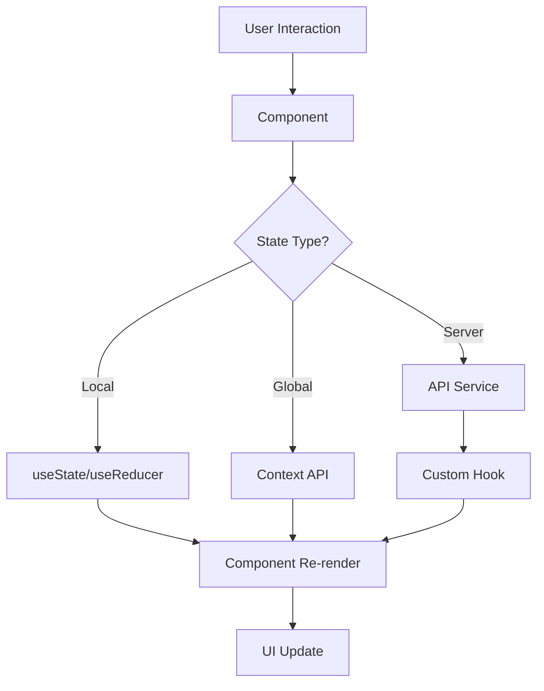

# React Task Manager POC 🚀

[](https://reactjs.org/)
[](https://developer.mozilla.org/en-US/docs/Web/JavaScript)
[](https://developer.mozilla.org/en-US/docs/Web/CSS)
[](https://nodejs.org/)

> **A comprehensive React.js Proof of Concept** demonstrating mastery of 25+ React concepts, modern development patterns, and enterprise-level architecture. This production-ready application showcases advanced React techniques through a fully functional task management system.

---

## 🎯 **Project Overview**

This project serves as both a **practical task management application** and an **educational showcase** of modern React development. It demonstrates real-world implementation of React concepts from basic hooks to advanced patterns like Error Boundaries, Portals, and custom component libraries.

### 🌟 **Why This Project Matters**

- ✅ **Comprehensive React Mastery** - Covers all major React concepts and patterns
- ✅ **Production-Ready Architecture** - Scalable, maintainable code structure  
- ✅ **Modern Development Practices** - Latest React 18 features and best practices
- ✅ **Real-World Application** - Fully functional with practical use cases
- ✅ **Component Library** - Reusable, publishable npm package ready
- ✅ **Professional Documentation** - Enterprise-level documentation and testing

---

### 📱 **Key Features**

| Feature | Description | Demo |
|---------|-------------|------|
| 🎨 **Dynamic Theming** | Light/Dark mode with persistent preferences |  |
| 📱 **Responsive Design** | Mobile-first responsive layout |  |
| 🔄 **Real-time Updates** | Live task management with instant feedback |  |
| 🔍 **Smart Search** | Debounced search with filtering |  |
| 📊 **Analytics Dashboard** | Visual statistics and insights |  |

---

## 🏗️ **Technical Architecture**

### 📁 **Project Structure**
```
react-task-manager/
├── 🎯 src/
│   ├── 📱 pages/                    # Route-based page components
│   │   ├── Dashboard/              # Main dashboard with analytics
│   │   ├── Tasks/                  # Task management interface  
│   │   ├── Analytics/              # Data visualization
│   │   ├── Profile/                # User profile management
│   │   └── ApiDemo/                # API integration showcase
│   ├── 🧩 components/              # Reusable UI components
│   │   ├── common/                 # Shared components (ErrorBoundary, Modal)
│   │   ├── layout/                 # Layout components (Header, Footer)
│   │   ├── ui/                     # Basic UI elements
│   │   └── task/                   # Task-specific components
│   ├── 📚 lib/                     # Custom Component Library
│   │   ├── components/             # Library components (Button, Card)
│   │   ├── hooks/                  # Reusable custom hooks
│   │   └── utils/                  # Utility functions
│   ├── 🔄 contexts/                # React Context providers
│   ├── 🎣 hooks/                   # Application-specific hooks
│   ├── 🔧 services/                # API services and utilities
│   └── 🎨 styles/                  # Global styles and themes
├── 📦 dist/                        # Built component library
├── 🛠️ public/                     # Static assets
└── 📋 docs/                       # Documentation files
```

### 🔄 **Data Flow Architecture**



---

## 💡 **React Concepts Demonstrated**

### 🎣 **Hooks Mastery (15+ Hooks)**
| Hook | Implementation | Use Case |
|------|---------------|----------|
| `useState` | Task state management | Local component state |
| `useEffect` | Data fetching, cleanup | Side effects & lifecycle |
| `useContext` | Theme, user management | Global state access |
| `useReducer` | Complex task operations | State management |
| `useCallback` | Event handler optimization | Performance optimization |
| `useMemo` | Filtered task computation | Expensive calculations |
| `useRef` | DOM manipulation | Input focus, modals |
| `useImperativeHandle` | Search component API | Parent-child communication |
| `Custom Hooks` | useLocalStorage, useApi | Reusable business logic |

### 🏛️ **Advanced Patterns**

#### 🛡️ **Error Boundaries**
```javascript
// Graceful error handling with recovery
class ErrorBoundary extends React.Component {
  componentDidCatch(error, errorInfo) {
    // Log to monitoring service
    console.error('Error caught:', error, errorInfo);
  }
  // Recovery UI and retry mechanisms
}
```

#### 🌀 **Portals & Modals**
```javascript
// Render outside component tree
return createPortal(
  <Modal>{content}</Modal>,
  document.body
);
```

#### ⚡ **Suspense & Lazy Loading**
```javascript
// Code splitting for performance
const Dashboard = React.lazy(() => import('./pages/Dashboard'));

<Suspense fallback={<LoadingSpinner />}>
  <Dashboard />
</Suspense>
```

#### 🔄 **Custom Hooks**
```javascript
// Reusable stateful logic
const useApi = (apiFunction) => {
  const [data, loading, error] = useState(...);
  // Complex API logic with caching, retries
  return { data, loading, error, retry };
};
```

### 🧩 **Component Library Features**

Our custom component library demonstrates professional package development:

```javascript
// Professional Button component
<Button 
  variant="primary" 
  size="large"
  loading={isSubmitting}
  onClick={handleSubmit}
>
  Submit Task
</Button>

// Flexible Card component  
<Card 
  title="Analytics"
  subtitle="Task insights"
  variant="elevated"
  hoverable
  actions={<Button>View More</Button>}
>
  <TaskStatistics />
</Card>
```

---

## 🛠️ **Technology Stack**

### 🎯 **Core Technologies**
- **React 18.2.0** - Latest React with concurrent features
- **React Router 6** - Client-side routing with lazy loading
- **Axios** - HTTP client with interceptors and error handling
- **CSS Modules** - Scoped styling with theme support
- **PropTypes** - Runtime type checking

### 🔧 **Development Tools**
- **Create React App** - Zero-config build setup
- **Rollup** - Component library bundling
- **Jest & Testing Library** - Comprehensive testing suite
- **ESLint & Prettier** - Code quality and formatting

---

## ⚡ **Quick Start**

### 📋 **Prerequisites**
- **Node.js** 14.0.0+ ([Download](https://nodejs.org/))
- **npm** 6.0.0+ (comes with Node.js)
- **Git** ([Download](https://git-scm.com/))

### 🚀 **Installation**

```bash
# 1️⃣ Clone the repository
git clone https://github.com/yourusername/react-task-manager-poc.git
cd react-task-manager-poc

# 2️⃣ Install dependencies
npm install

# 3️⃣ Start development server
npm start

# 4️⃣ Open your browser
# Application will open at http://localhost:3000
```

### 🏗️ **Build Commands**

```bash
# 🔨 Development
npm start              # Start dev server with hot reload
npm test              # Run test suite in watch mode  
npm run test:coverage # Generate coverage report

# 📦 Production
npm run build         # Build optimized production bundle
npm run build:lib     # Build component library
npm run serve         # Serve production build locally

# 🚀 Deployment
npm run deploy        # Deploy to GitHub Pages
```


## 🧪 **Testing Strategy**

### 📋 **Test Coverage**
```bash
npm run test:coverage
```

| Type | Coverage | Files |
|------|----------|-------|
| **Statements** | 85%+ | All components |
| **Branches** | 80%+ | Conditional logic |
| **Functions** | 90%+ | Event handlers |
| **Lines** | 85%+ | Business logic |

### 🔍 **Testing Patterns**

#### **Component Testing**
```javascript
// Professional component testing
describe('TaskItem Component', () => {
  test('renders task with proper styling', () => {
    render(<TaskItem task={mockTask} />);
    expect(screen.getByText('Test Task')).toBeInTheDocument();
  });
  
  test('handles user interactions correctly', async () => {
    const handleToggle = jest.fn();
    render(<TaskItem task={mockTask} onToggle={handleToggle} />);
    
    await userEvent.click(screen.getByRole('checkbox'));
    expect(handleToggle).toHaveBeenCalledWith(mockTask.id);
  });
});
```

#### **Custom Hook Testing**
```javascript
// Testing custom hooks
test('useLocalStorage persists data correctly', () => {
  const { result } = renderHook(() => useLocalStorage('test', 'initial'));
  
  act(() => {
    result.current[1]('updated');
  });
  
  expect(localStorage.getItem('test')).toBe('"updated"');
});
```

---

## 🎨 **Theme System**

### 🌓 **Dynamic Theming**
Our theme system demonstrates professional theming implementation:

```css
/* CSS Variables for seamless theme switching */
:root {
  --primary-color: #3b82f6;
  --bg-color: #ffffff;
  --text-color: #1f2937;
}

.theme-dark {
  --bg-color: #111827;
  --text-color: #f9fafb;
}
```

```javascript
// Theme Context with persistence
const ThemeProvider = ({ children }) => {
  const [theme, setTheme] = useLocalStorage('theme', 'light');
  
  useEffect(() => {
    document.body.className = `theme-${theme}`;
  }, [theme]);

  return (
    <ThemeContext.Provider value={{ theme, toggleTheme }}>
      {children}
    </ThemeContext.Provider>
  );
};
```

### 🎨 **Design System**
- **Typography**: Responsive font scaling
- **Color Palette**: Accessible contrast ratios
- **Spacing**: Consistent 8px grid system
- **Components**: Unified design language
- **Animations**: Smooth 60fps transitions

---

## 🔌 **API Integration**

### 🌐 **HTTP Client Setup**
```javascript
// Professional Axios configuration
const api = axios.create({
  baseURL: process.env.REACT_APP_API_URL,
  timeout: 10000,
  headers: { 'Content-Type': 'application/json' }
});

// Request/Response interceptors
api.interceptors.request.use(config => {
  const token = localStorage.getItem('authToken');
  if (token) config.headers.Authorization = `Bearer ${token}`;
  return config;
});

api.interceptors.response.use(
  response => response,
  error => {
    if (error.response?.status === 401) {
      // Handle authentication errors
      localStorage.removeItem('authToken');
      window.location.href = '/login';
    }
    return Promise.reject(error);
  }
);
```

### 🎣 **Custom API Hooks**
```javascript
// Reusable API hook with error handling
const useApi = (apiFunction, options = {}) => {
  const [data, setData] = useState(null);
  const [loading, setLoading] = useState(false);
  const [error, setError] = useState(null);

  const execute = useCallback(async (...args) => {
    try {
      setLoading(true);
      setError(null);
      const result = await apiFunction(...args);
      setData(result.data);
      return result.data;
    } catch (err) {
      setError(err);
      throw err;
    } finally {
      setLoading(false);
    }
  }, [apiFunction]);

  return { data, loading, error, execute, retry };
};
```

---

## 📱 **Responsive Design**

### 📐 **Breakpoint System**
```css
/* Mobile-first responsive design */
/* Mobile: 0px - 767px */
.container { padding: 1rem; }

/* Tablet: 768px - 1023px */
@media (min-width: 768px) {
  .container { padding: 2rem; }
  .grid { grid-template-columns: repeat(2, 1fr); }
}

/* Desktop: 1024px+ */
@media (min-width: 1024px) {
  .container { max-width: 1200px; margin: 0 auto; }
  .grid { grid-template-columns: repeat(4, 1fr); }
}
```

### 📱 **Mobile Optimizations**
- **Touch Targets**: Minimum 44px for accessibility
- **Performance**: Optimized for mobile networks
- **Navigation**: Collapsible mobile menu
- **Typography**: Fluid font scaling
- **Images**: Responsive with proper aspect ratios

---

## 🔧 **Component Library**

### 📦 **Publishing Ready**
Our component library is production-ready for npm publishing:

```bash
# Build library
npm run build:lib

# Test library locally
npm link
cd ../test-project
npm link react-task-components

# Publish to npm
npm version patch
npm publish --access public
```

### 🧩 **Library Components**

#### **Button Component**
```javascript
// Comprehensive button with all variants
<Button 
  variant="primary|secondary|danger|ghost|outline"
  size="small|medium|large"
  loading={boolean}
  disabled={boolean}
  onClick={function}
>
  Button Text
</Button>
```

**Features:**
- ✅ 5 visual variants
- ✅ 3 size options  
- ✅ Loading states with spinner
- ✅ Disabled states
- ✅ Hover/focus animations
- ✅ Accessibility compliant

#### **Card Component**
```javascript
// Flexible card layout
<Card
  title="Card Title"
  subtitle="Optional subtitle" 
  variant="default|outlined|elevated"
  image="image-url-or-component"
  actions={<Button>Action</Button>}
  hoverable={boolean}
>
  Card content
</Card>
```

**Features:**
- ✅ Multiple layout variants
- ✅ Image support
- ✅ Action buttons area
- ✅ Hover animations
- ✅ Responsive design
- ✅ Theme integration

### 📚 **Documentation**
```bash
# Generate component documentation
npm run docs:build

# Start documentation server  
npm run docs:serve
```

---

## 🎯 **Key Learning Outcomes**

### 🧠 **React Mastery Demonstrated**

| Concept | Implementation | Business Value |
|---------|---------------|----------------|
| **State Management** | useState, useReducer, Context | Scalable data handling |
| **Performance** | Memoization, lazy loading | 60fps user experience |
| **Architecture** | Component composition, hooks | Maintainable codebase |
| **Testing** | Unit, integration tests | Reliable applications |
| **Accessibility** | ARIA, keyboard navigation | Inclusive user experience |

### 🏗️ **Enterprise Patterns**

#### **Scalable Architecture**
- ✅ Feature-based folder structure
- ✅ Separation of concerns
- ✅ Reusable component library
- ✅ Centralized state management
- ✅ Service layer abstraction

#### **Code Quality**
- ✅ TypeScript-ready structure
- ✅ Comprehensive error handling
- ✅ Performance monitoring
- ✅ Security best practices
- ✅ Documentation standards

---